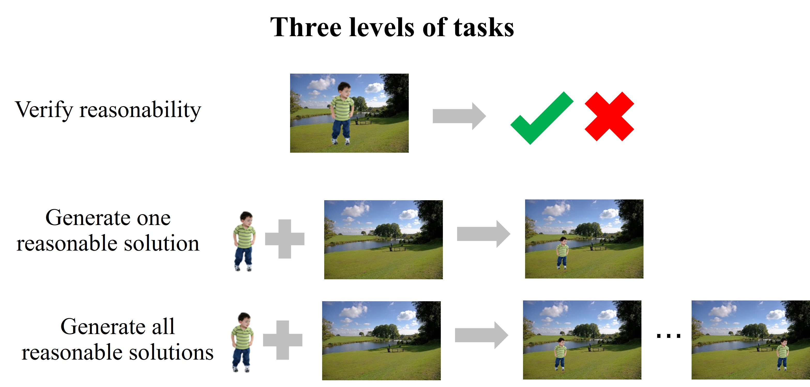

# Awesome Object Placement 

A curated list of resources including papers, datasets, and relevant links pertaining to object placement, which aims to learn plausible **spatial transformation** (e.g., shifting, scaling, affine transformation, perspective transformation) for the inserted foreground object in a composite image considering geometric and semantic information. The simplest case is finding reasonable **location and scale** for the foreground object. For more complete resources on general image composition ([object insertion](https://github.com/bcmi/Awesome-Object-Insertion)), please refer to [Awesome-Image-Composition](https://github.com/bcmi/Awesome-Object-Insertion).

We can define three levels of tasks for object placement. (1) Level 1: given a composite image, verify whether the foreground placement is reasonable. (2) Level 2: given a pair of foreground and background, generate one composite image with reasonable foreground placement. (3) Level 3: given a pair of foreground and background, generate all composite images with reasonable foreground placement.

  
  

## Contributing

Contributions are welcome.  If you wish to contribute, feel free to send a pull request. If you have suggestions for new sections to be included, please raise an issue and discuss before sending a pull request.

## Table of Contents
+ [Survey](#Survey)
+ [Online Demo](#Online-demo)
+ [Papers](#Papers)
+ [Datasets](#Datasets)
+ [Other Resources](#Other-resources)

## Survey

A brief review on object placement is included in the following survey on image composition:

Li Niu, Wenyan Cong, Liu Liu, Yan Hong, Bo Zhang, Jing Liang, Liqing Zhang: "*Making Images Real Again: A Comprehensive Survey on Deep Image Composition.*" arXiv preprint arXiv:2106.14490 (2021). [[arXiv]](https://arxiv.org/pdf/2106.14490.pdf) [[slides]](https://www.ustcnewly.com/download/Image_composition_tutorial.pdf)

## Online Demo

Try this [online demo](http://libcom.ustcnewly.com/) for image composition (object insertion) built upon [libcom](https://github.com/bcmi/libcom) toolbox and have fun!

[![]](https://github.com/user-attachments/assets/87416ec5-2461-42cb-9f2d-5030b1e1b5ec)

## Papers

#### 1. Instance-specific: predict transformation parameters given a pair of foreground and background

##### 1.1 Generative Methods

+ Xianhe Cheng, Peng Zhai, Dingkang Yang, Xiangrui Meng, Yang Xia, Lihua Zhang: "*Diverse Object Placement with Dual Interaction.*" Neurocomputing (2025) [[pdf]](https://www.sciencedirect.com/science/article/pii/S0925231225018338)

+ Hang Zhou, Xinxin Zuo, Rui Ma, Li Cheng: "*BOOTPLACE: Bootstrapped Object Placement with Detection Transformers.*" CVPR (2025) [[pdf]](https://arxiv.org/pdf/2503.21991) [[code]](https://github.com/RyanHangZhou/BOOTPLACE)

+  Gemma Canet Tarrés, Zhe Lin, Zhifei Zhang, Jianming Zhang, Yizhi Song, Dan Ruta, Andrew Gilbert, John Collomosse, Soo Ye Kim: "*Thinking Outside the BBox: Unconstrained Generative Object Compositing.*" ECCV (2024) [[pdf]](https://arxiv.org/pdf/2409.04559) 

+ Yaxuan Qin, Jiayu Xu, Ruiping Wang, Xilin Chen: "*Think before Placement: Common Sense Enhanced Transformer for Object Placement.*" ECCV (2024) [[pdf]](https://www.ecva.net/papers/eccv_2024/papers_ECCV/papers/09204.pdf) [[code]](https://github.com/JiayuXu829/ThinkBeforePlacement)

+ Jiacheng Liu, Shida Wei, Rui Ma: "*Conditional Transformation Diffusion for Object Placement.*" ICIGP (2024) [[pdf]](https://dl.acm.org/doi/pdf/10.1145/3647649.3647706)

+ Yibin Wang, Yuchao Feng, Jianwei Zheng: "*Learning Object Placement via Convolution Scoring Attention.*" BMVC (2024) [[pdf]](https://bmva-archive.org.uk/bmvc/2024/papers/Paper_165/paper.pdf) [[code]](https://github.com/CodeGoat24/CSANet)

+ Guosheng Ye, Jianming Wang, Zizhong Yang: "*Efficient Object Placement via FTOPNet.*" Electronics (2023) [[pdf]](https://www.mdpi.com/2079-9292/12/19/4106)

+ Shengping Zhang, Quanling Meng, Qinglin Liu, Liqiang Nie, Bineng Zhong, Xiaopeng Fan, Rongrong Ji: "*Interactive Object Placement with Reinforcement Learning.*" ICML (2023) [[pdf]](https://openreview.net/pdf?id=hwHBaL7wur)

+ Yibin Wang, Yuchao Feng, Jie Wu, Honghui Xu, Jianwei Zheng: "*CA-GAN: Object Placement via Coalescing Attention based Generative Adversarial Network.*" ICME (2023) [[pdf]](https://ieeexplore.ieee.org/stamp/stamp.jsp?arnumber=10219885&casa_token=ti6N3G0_3WQAAAAA:4GFxgkc3U-U4HRGj689_9EpJq3Of9xiqVvLhD7ZGcdBtJQKqK_oujKNnfhgZHzZ-1rhXkF3H)
 
+ Siyuan Zhou, Liu Liu, Li Niu, Liqing Zhang: "*Learning Object Placement via Dual-path Graph Completion.*" ECCV (2022) [[arXiv]](https://arxiv.org/pdf/2207.11464.pdf) [[code]](https://github.com/bcmi/GracoNet-Object-Placement)

+ Lingzhi Zhang, Tarmily Wen, Jie Min, Jiancong Wang, David Han, Jianbo Shi: "*Learning Object Placement by Inpainting for Compositional Data Augmentation.*" ECCV (2020) [[pdf]](https://www.ecva.net/papers/eccv_2020/papers_ECCV/papers/123580562.pdf)

+ Shashank Tripathi, Siddhartha Chandra, Amit Agrawal, Ambrish Tyagi, James M. Rehg, Visesh Chari: "*Learning to Generate Synthetic Data via Compositing.*" CVPR (2019) [[arXiv]](https://arxiv.org/pdf/1904.05475.pdf)

+ Chen-Hsuan Lin, Ersin Yumer, Oliver Wang, Eli Shechtman, Simon Lucey: "*ST-GAN: Spatial Transformer Generative Adversarial Networks for Image Compositing.*" CVPR (2018) [[arXiv]](https://arxiv.org/pdf/1803.01837.pdf) [[code]](https://github.com/chenhsuanlin/spatial-transformer-GAN)

##### 1.2 Discriminative Methods

+ Bingjie Gao, Bo Zhang, Li Niu: "*Object Placement for Anything.*"  ICME (2025) [[arXiv]](https://arxiv.org/pdf/2504.12029)

+ Matthew Poska, Sharon X. Huang, Bin Hwang: "*HopNet: Harmonizing object placement network for realistic image generation via object composition.*" (2025) [[pdf]](https://assets.amazon.science/51/89/cc524d884b4ca51a6034aefab1f6/hopnet-harmonizing-object-placement-network-for-realistic-image-generation-via-object-composition.pdf)
  
+ Sijie Zhu, Zhe Lin, Scott Cohen, Jason Kuen, Zhifei Zhang, Chen Chen: "*TopNet: Transformer-based Object Placement Network for Image Compositing.*"  CVPR (2023) [[pdf]](https://openaccess.thecvf.com/content/CVPR2023/papers/Zhu_TopNet_Transformer-Based_Object_Placement_Network_for_Image_Compositing_CVPR_2023_paper.pdf)

+ Li Niu, Qingyang Liu, Zhenchen Liu, Jiangtong Li: "*Fast Object Placement Assessment.*" arXiv:2205.14280 (2022) [[arXiv]](https://arxiv.org/pdf/2205.14280.pdf) [[code]](https://github.com/bcmi/FOPA-Fast-Object-Placement-Assessment)

+ Liu Liu, Zhenchen Liu, Bo Zhang, Jiangtong Li, Li Niu, Qingyang Liu, Liqing Zhang: "*OPA: Object Placement Assessment Dataset.*" arXiv:2107.01889 (2021) [[arXiv]](https://arxiv.org/pdf/2107.01889.pdf)[[code]](https://github.com/bcmi/Object-Placement-Assessment-Dataset-OPA)

#### 2. Category-specific: predict placement for certain category given a background

##### 2.1 Generative Methods

+ Rishubh Parihar, Harsh Gupta, Sachidanand VS, R. Venkatesh Babu: "*Text2Place: Affordance-aware Text Guided Human Placement.*" ECCV (2024) [[pdf]](https://www.ecva.net/papers/eccv_2024/papers_ECCV/papers/00308.pdf) [[code]](https://github.com/Harsh-Gupta9897/Text2Place)

+ Jieteng Yao, Junjie Chen, Li Niu, Bin Sheng: "*Scene-aware Human Pose Generation using Transformer.*" ACM MM (2023) [[pdf]](https://arxiv.org/pdf/2308.02177)

+ Donghoon Lee, Sifei Liu, Jinwei Gu, Ming-Yu Liu, Ming-Hsuan Yang, Jan Kautz: "*Context-Aware Synthesis and Placement of Object Instances.*" NeurIPS (2018) [[pdf]](https://proceedings.neurips.cc/paper/2018/file/c6969ae30d99f73951cb976b88a457af-Paper.pdf)

+ Fuwen Tan, Crispin Bernier, Benjamin Cohen, Vicente Ordonez, Connelly Barnes: "*Where and Who? Automatic Semantic-Aware Person Composition.*" WACV (2018) [[arXiv]](https://arxiv.org/pdf/1706.01021.pdf)[[code]](https://github.com/fwtan/who_where)

##### 2.2 Discriminative Methods

+ Lu Yuan, James Hong, Vishnu Sarukkai, Kayvon Fatahalian: "*Learning to place objects into scenes by hallucinating scenes around objects.*" NeurIPS Workshop (2023) [[pdf]](https://openreview.net/pdf/75f46a7ff0b8faa6cf50876babbcd77847e16301.pdf)

+ Anna Volokitin, Igor Susmelj, Eirikur Agustsson, Luc Van Gool, Radu Timofte: "*Efficiently Detecting Plausible Locations for Object Placement Using Masked Convolutions.*" ECCV workshop (2020) [[pdf]](https://link.springer.com/chapter/10.1007/978-3-030-66823-5_15)

+ Nikita Dvornik, Julien Mairal, Cordelia Schmid: "*On the Importance of Visual Context for Data Augmentation in Scene Understanding.*" T-PAMI (2019) [[arXiv]](https://arxiv.org/pdf/1809.02492.pdf)
    
+ Nikita Dvornik, Julien Mairal, Cordelia Schmid: "*Modeling Visual Context is Key to Augmenting Object Detection Datasets.*" ECCV (2018) [[pdf]](https://openaccess.thecvf.com/content_ECCV_2018/papers/NIKITA_DVORNIK_Modeling_Visual_Context_ECCV_2018_paper.pdf)

## Datasets

+ **OPAZ**:  7 distinct categories of foreground objects with 15 images for each category. 10 background images for each category. OPAZ comprises 8,160 generated images, of which 1,390 are labeled as rational, and 6,770 as irrational. [[pdf]](https://www.ecva.net/papers/eccv_2024/papers_ECCV/papers/09204.pdf) [[link]](https://github.com/JiayuXu829/ThinkBeforePlacement)
  
+ **OPA**: it contains 62,074 training images and 11,396 test images, in which the foregrounds/backgrounds in training set and test set have no overlap. The training (resp., test) set contains 21,376 (resp.,3,588) positive samples and 40,698 (resp., 7,808) negative samples. Besides, the training (resp., test) set contains 2,701 (resp., 1,436) unrepeated foreground objects and1,236 (resp., 153) unrepeated background images. [[pdf]](https://arxiv.org/pdf/2107.01889.pdf) [[link]](https://github.com/bcmi/Object-Placement-Assessment-Dataset-OPA)

 
## Related Topics

#### Out-of-Context Object

+ Philipp Bomatter, Mengmi Zhang, Dimitar Karev, Spandan Madan, Claire Tseng, Gabriel Kreiman: "*When Pigs Fly: Contextual Reasoning in Synthetic and Natural Scenes.*" ICCV (2021) [[paper]](https://openaccess.thecvf.com/content/ICCV2021/papers/Bomatter_When_Pigs_Fly_Contextual_Reasoning_in_Synthetic_and_Natural_Scenes_ICCV_2021_paper.pdf) [[dataset&code]](https://github.com/kreimanlab/WhenPigsFlyContext)

+ Manoj Acharya, Anirban Roy, Kaushik Koneripalli, Susmit Jha, Christopher Kanan, Ajay Divakaran: "*Detecting Out-Of-Context Objects Using Graph Context Reasoning Network.*" IJCAI (2022) [[paper]](https://www.ijcai.org/proceedings/2022/0089.pdf)

## Other Resources

+ [Awesome-Image-Composition](https://github.com/bcmi/Awesome-Object-Insertion)

